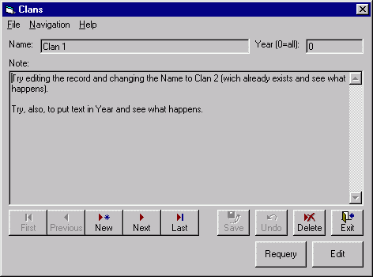



## \_SG\_ \- DB Template

### Description

Example on how a template can drastically accelerate development time for a Database app.

With this template, you just have to drop the text controls you want on the form, modify their tag property (see file _Notes.txt) and modify the SQL string that the form uses to get data and voilà.

The code will take care of the MoveFirst, MovePrevious, NewRecord, MoveNext, MoveLast, SaveRecord, DeleteRecord, Undo, Requery, EditRecord and CloseForm. It will automatically enable/disable the controls based on what the user is doing and his location in the rescordset. There is even options (in the tag property) to set default values and field validation (alpha or numeric). Since it's the tag property that drives most of the features of the app, the code is very portable/reusable.

The template only uses UNBOUND forms (i.e. there is NO Data Control) and is well commented.
 
### More Info
 

             |
---                |---
**Submitted On**   |2002-04-24 21:56:18
**By**             |[Steve Grant](https://github.com/Planet-Source-Code/PSCIndex/blob/master/ByAuthor/steve-grant.md)
**Level**          |Intermediate
**User Rating**    |4.6 (190 globes from 41 users)
**Compatibility**  |VB 5\.0, VB 6\.0
**Category**       |[Databases/ Data Access/ DAO/ ADO](https://github.com/Planet-Source-Code/PSCIndex/blob/master/ByCategory/databases-data-access-dao-ado__1-6.md)
**World**          |[Visual Basic](https://github.com/Planet-Source-Code/PSCIndex/blob/master/ByWorld/visual-basic.md)
**Archive File**   |[\_SG\_\_\-\_DB\_755914242002\.zip](https://github.com/Planet-Source-Code/steve-grant-sg-db-template__1-9487/archive/master.zip)

